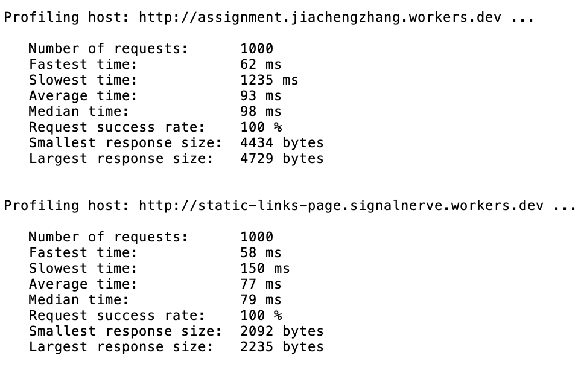
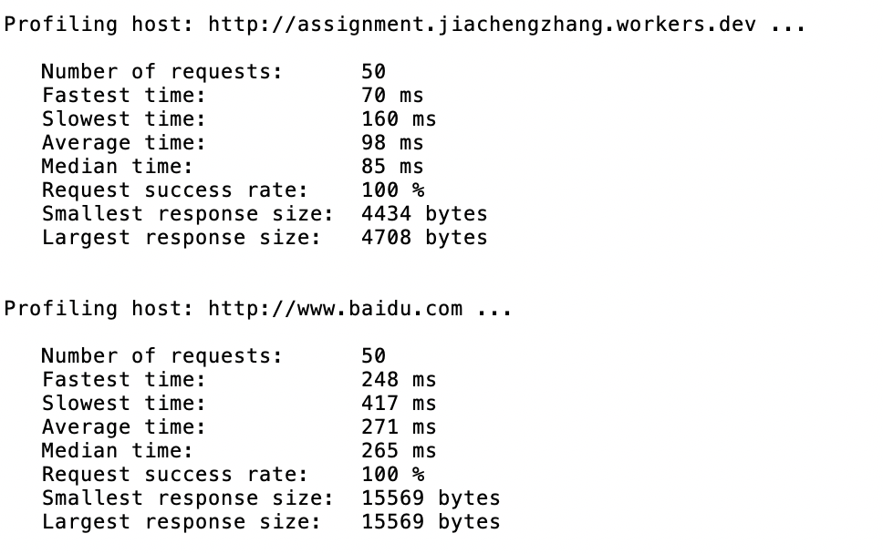
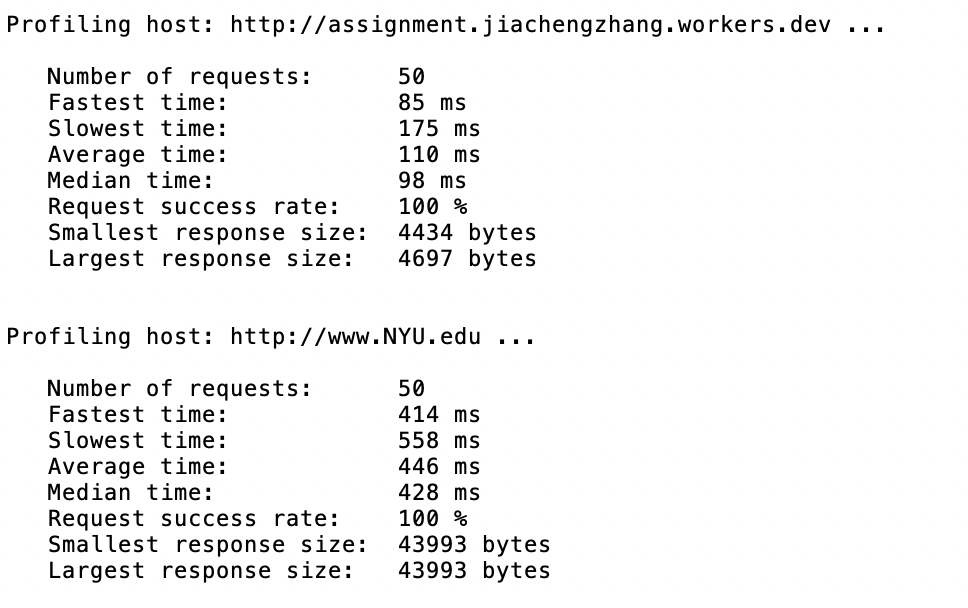

# Systems Engineering Assignment
Author: **Jiacheng Zhang**  
Email:  **jiachengzhang1@email.arizona.edu**

## Build
Make sure [gcc](https://gcc.gnu.org/install/) is installed.
1. Unzip the project `unzip path/to/http_get.zip -d http_get`.
2. Change into the project directory `cd path/to/http_get/`.
3. Use `make` command to compile the code. Run `make` or `make all`. Make sure `Makefile` is in the directory.
4. Executable `http_get` should be generated along with object files.
5. `make clean` to delete compiled files and the executable.

## Run

1. `./http_get --url <Full URL>` Make HTTP request to URL and print the response to the console

- `<Full URL>` Required. Define the URL to make requests. Prefix `http://` is required.
- For example, `./http_get --url http://assignment.jiachengzhang.workers.dev/links`

2. `./http_get --help` Print help page.

3. `./http_get --profile <Number of Requests> <Full URL>` Measure website's performance.

- `<Number of Request>` Required. Make the given number of requests to the server.
- `<Full URL>` Optional. Define the URL to make requests. Prefix `http://` is required. It is set as website built from "General Assignment" (http://assignment.jiachengzhang.workers.dev) if there's not a provided URL.
- For example, `./http_get --profile 10` makes 10 requests to `http://assignment.jiachengzhang.workers.dev` by default, then prints out the performance. `./http_get --profile 10 http://static-links-page.signalnerve.workers.dev` makes 10 requests to `http://static-links-page.signalnerve.workers.dev`, then prints out the performance.

## Profile

### Perform Testing
Once the program is compiled via `make`, it's time for performance measurement. Run `bash run_test.sh <Number of Requests> <Site1's URL> <Site2's URL>` to perform comparison between two sites. `<Number of Requests>`, `<Site1's URL>` and `<Site2's URL>` are optional. Run `bash run_test.sh` to profile [`assignment.jiachengzhang.worker site`](http://assignment.jiachengzhang.workers.dev) and [`static-links-page site`](http://static-links-page.signalnerve.workers.dev) (**Sites Comparison 1** with only 100 requests). Results can be found in `profile.txt`.

### Sites Comparison 1
##### Result
I choose to compare my site built for general assignment [`assignment.jiachengzhang.worker site`](http://assignment.jiachengzhang.workers.dev) and the site that my site fetches static page from [`static-links-page site`](http://static-links-page.signalnerve.workers.dev). The results are following,

##### Conclusion
I think this is a representaive comparison. `assignment.jiachengzhang.worker site` requires extra time to fetch and wait the static page responsed by the `static-links-page site`, then inject more content. Because both of the sites are hosted by Cloudflare, I assume that two servers are close to each other. The resulted statistics demostrated that `assignment.jiachengzhang.worker site` takes more time to send back responses, and it also has larger response sizes compared to `static-links-page site` among 1000 requests.
### Sites Comparison 2
##### Result
Here's the comparison between [`assignment.jiachengzhang.worker site`](http://assignment.jiachengzhang.workers.dev) and [`baidu`](http://www.baidu.com), the most popular search engine in China, results are following,

##### Conclusion
Becuase the responsed web page of `Baidu` has JavaScript and more content, its response size is larger than `assignment.jiachengzhang.worker site`. In addition, `Baidu`'s `smallest response size` is the same as `largest response size` while `assignment.jiachengzhang.worker site` has different smallest and largest response size, it may be because `assignment.jiachengzhang.worker site`'s content is random while `Baidu`'s not. Lastly, `Baidu`'s response has higher latency than `assignment.jiachengzhang.worker site`. One reason could be my location is closer to Cloudflare's server than to Baidu's which is located in China; it could also because `Baidu`'s server is much busier than `assignment.jiachengzhang.worker site` due to the fact that it needs to handle large numer of requests every seconds.
### Sites Comparison 3
##### Result
The following is the comparison between [`assignment.jiachengzhang.worker site`](http://assignment.jiachengzhang.workers.dev) and [`New York University's Official Website`](http://www.NYU.edu),

##### Conclusion
Among 50 requests to both websites, `New York University's Official Website` has 3 times higher latency on average than `assignment.jiachengzhang.worker site`'s, and has response that's 3 times larger than `assignment.jiachengzhang.worker site` in term of the largest response.
